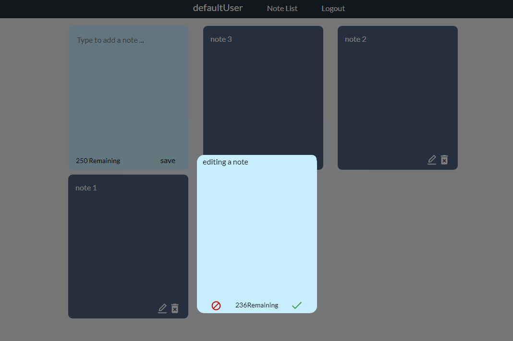

# Notes application

A fully responsive web application that allows you to create and store notes.

### Technologies used in application

- Spring boot
- Hibernate/JPA
- JWT
- JUnit
- MockMvc
- MySQL
- React.js
- Node.js
- HTML5
- CSS3

## Documentation

Swagger is available at http://localhost:8080/swagger-ui.html

### Access

Secured endpoints require `Authorization` header with `Bearer <your_token>`.

Use `Authorize` button to provide correct token.

### How to get token?

```
  1. curl --request POST 'http://localhost:8080/api/auth/login' \
    --header 'Content-Type: application/x-www-form-urlencoded' \
    --data-urlencode 'username=your_username' \
    --data-urlencode 'password=your_password'
     
  2. Copy "access_token"
```

## **Functionalities and Features:**

- user registration

- authentication and authorization with `JSON Web Token`

- checking permissions performing any operations

- custom error handling

- unit and integration tests using `JUnit` and `MockMvc`

- notes:
    - create
    - read
    - update
    - delete

- implement factory method pattern

- integration with `MySQL` database me

## Screenshots



